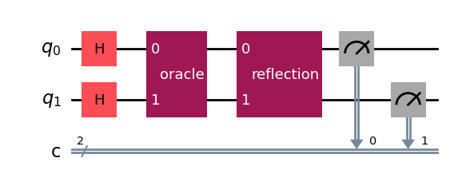
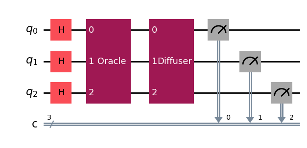

# Implementation of Grover's algorithm using 2 and 3 qubit systems

Grover’s algorithm is a quantum algorithm that solves the unstructured search problem. In an unstructured search problem, we are given a set of N elements and we want to find a single marked element. A classical computer would need to search through all N elements in order to find the marked element, which would take time O(N). Grover’s algorithm, on the other hand, can find the marked element in time  O(√ N).

## Two Qubit Circuit design

## Three Qubit Circuit design

